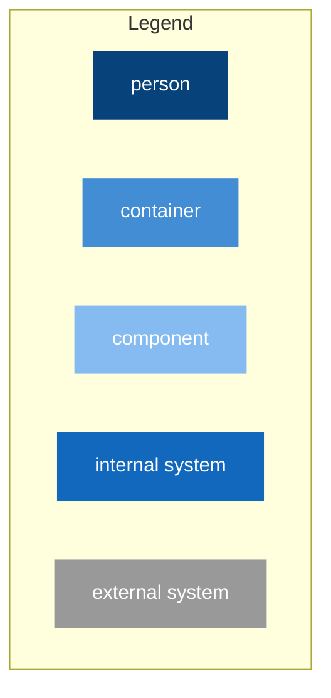
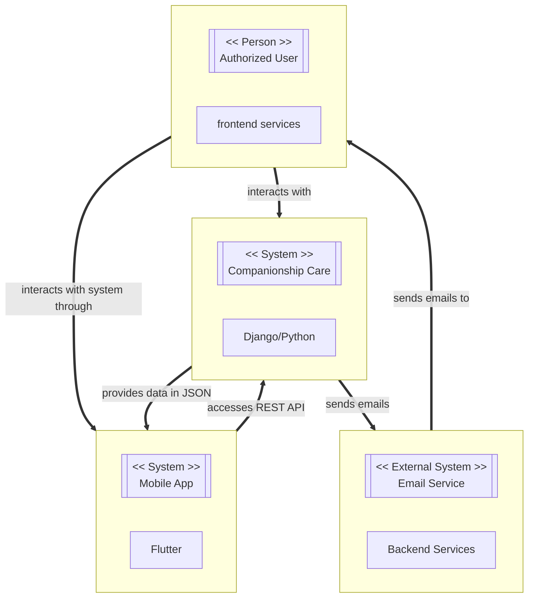
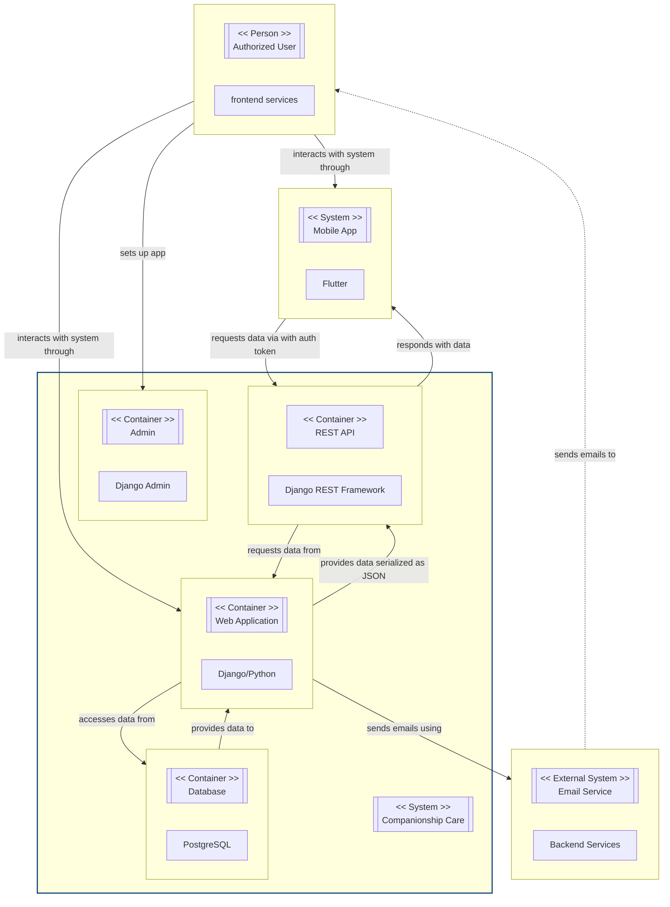
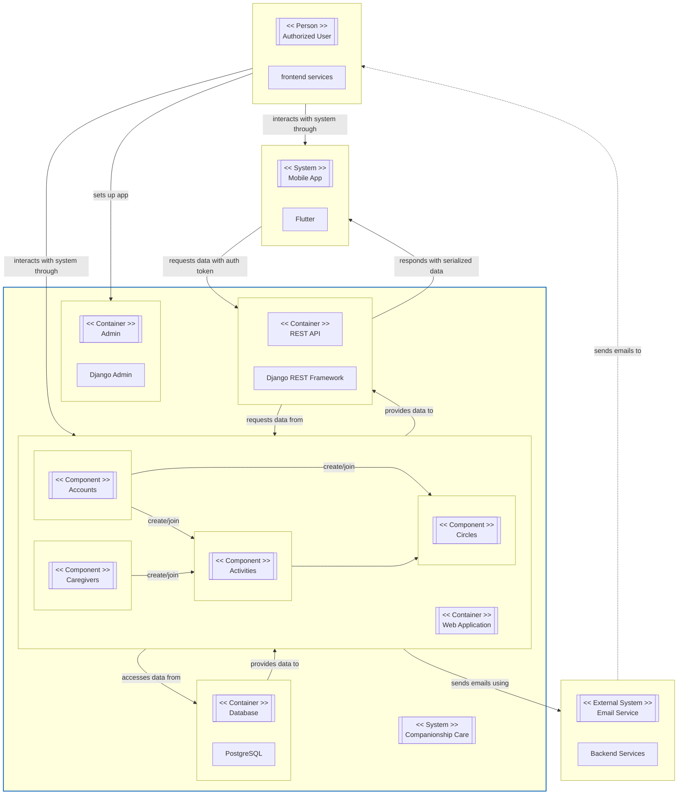
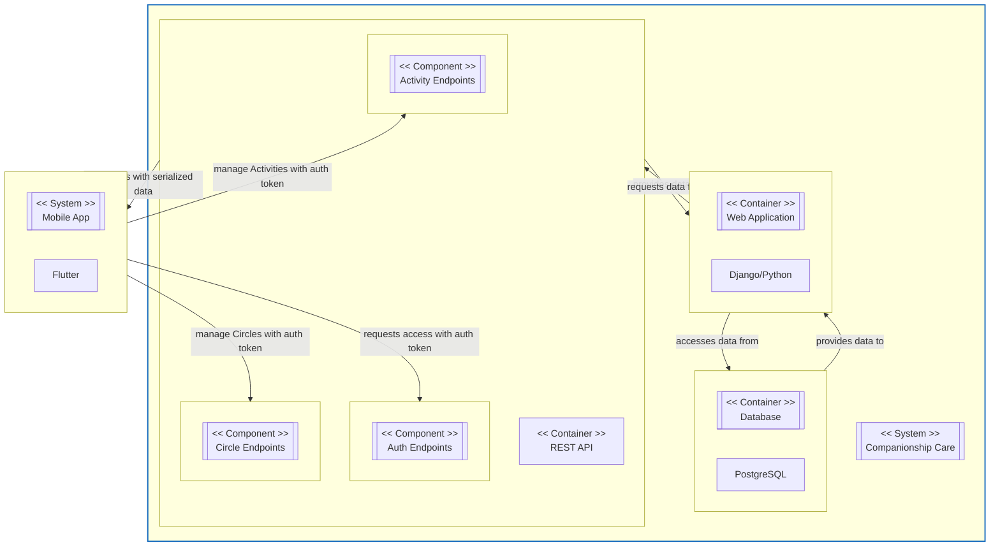

# C4 Model

## Legend

```mermaid
flowchart TB
classDef borderless stroke-width:0px
classDef darkBlue fill:#08427B, color:#fff, stroke:#08427B, stroke-width:2px
classDef blue fill:#1168BD, color:#fff, stroke:#1168BD, stroke-width:2px
classDef lightBlue fill:#438DD5, color:#fff, stroke:#438DD5, stroke-width:2px
classDef brightBlue fill:#85BBF0, color:#fff, stroke:#85BBF0, stroke-width:2px
classDef grey fill:#999999, color:#fff, stroke:#999999, stroke-width:2px

subgraph Legend[Legend]
    Legend1[person]
    Legend2[container]
    Legend3[component]
    Legend4[internal system]
    Legend5[external system]
end

class Legend1 darkBlue
class Legend2 lightBlue
class Legend3 brightBlue
class Legend4 blue
class Legend5 grey
```

## Context Diagram

```mermaid
flowchart TB
classDef borderless stroke-width:0px
classDef darkBlue fill:#08427B, color:#fff, stroke:#08427B, stroke-width:2px
classDef blue fill:#1168BD, color:#fff, stroke:#1168BD, stroke-width:2px
classDef lightBlue fill:##438DD5, color:#fff, stroke:##438DD5, stroke-width:2px
classDef grey fill:#999999, color:#fff, stroke:#999999, stroke-width:2px

subgraph emailService[ ]
    A0[[<< External System >><br/>Email Service]]
    B0[Backend Services]
end
class emailService grey

subgraph softwareSystem[ ]
    A1[[<< System >><br/>Companionship Care]]
    B1[Django/Python]
end
class softwareSystem blue

subgraph mobileApp[ ]
    A2[[<< System >><br/>Mobile App]]
    B2[Flutter]
end
class mobileApp blue

subgraph authorizedUser[ ]
    A3[[<< Person >><br/>Authorized User]]
    B4[frontend services]
end
class authorizedUser darkBlue


authorizedUser == interacts with ==> softwareSystem
authorizedUser == interacts with system through ==> mobileApp
mobileApp == accesses REST API ==> softwareSystem
softwareSystem == provides data in JSON ==> mobileApp
softwareSystem == sends emails ==> emailService
emailService == sends emails to ==> authorizedUser

```

## Container Diagram

```mermaid
flowchart TB
classDef borderless stroke-width:0px
classDef darkBlue fill:#08427B, color:#fff, stroke:#08427B, stroke-width:2px
classDef blue fill:#1168BD, color:#fff, stroke:#1168BD, stroke-width:2px
classDef lightBlue fill:#438DD5, color:#fff, stroke:#438DD5, stroke-width:2px
classDef grey fill:#999999, color:#fff, stroke:#999999, stroke-width:2px
classDef blueBorder stroke:#08427B, stroke-width:2px


subgraph emailService[ ]
    A0[[<< External System >><br/>Email Service]]
    B0[Backend Services]
end
class emailService grey

subgraph softwareSystem[ ]
    A1[[<< System >><br/>Companionship Care]]

    subgraph webApp[ ]
        A11[[<< Container >><br/>Web Application]]
        B11[Django/Python]
    end
    class webApp lightBlue

    subgraph db[ ]
        A12[[<< Container >><br/>Database]]
        B12[PostgreSQL]
    end
    class db lightBlue

    subgraph admin[ ]
        A13[[<< Container >><br/>Admin]]
        B13[Django Admin]
    end
    class admin lightBlue

    subgraph restApi[ ]
        A14[<< Container >><br/>REST API]
        B14[Django REST Framework]
    end
    class restApi lightBlue
end
class softwareSystem blueBorder


subgraph mobileApp[ ]
    A2[[<< System >><br/>Mobile App]]
    B2[Flutter]
end
class mobileApp blue

subgraph authorizedUser[ ]
    A3[[<< Person >><br/>Authorized User]]
    B3[frontend services]
end
class authorizedUser darkBlue

authorizedUser -- interacts with system through --> mobileApp
emailService -. sends emails to .-> authorizedUser

authorizedUser -- sets up app --> admin
authorizedUser -- interacts with system through --> webApp
webApp -- accesses data from --> db
db -- provides data to --> webApp
webApp -- provides data serialized as JSON --> restApi
mobileApp -- requests data via with auth token --> restApi
restApi -- responds with data --> mobileApp
restApi -- requests data from --> webApp
webApp -- sends emails using --> emailService

```

## Component Diagram (Web Application)

```mermaid
flowchart TB
classDef borderless stroke-width:0px
classDef darkBlue fill:#08427B, color:#fff, stroke:#08427B, stroke-width:2px
classDef blue fill:#1168BD, color:#fff, stroke:#1168BD, stroke-width:2px
classDef lightBlue fill:#438DD5, color:#fff, stroke:#438DD5, stroke-width:2px
classDef brightBlue fill:#85BBF0, color:#fff, stroke:#85BBF0, stroke-width:2px
classDef grey fill:#999999, color:#fff, stroke:#999999, stroke-width:2px
classDef LightBlueBorder stroke:#438DD5, stroke-width:2px
classDef blueBorder stroke:#1168BD, stroke-width:2px

subgraph emailService[ ]
    A0[[<< External System >><br/>Email Service]]
    B0[Backend Services]
end
class emailService grey

subgraph softwareSystem[ ]
    A1[[<< System >><br/>Companionship Care]]

    subgraph webApp[ ]
        A11[[<< Container >><br/>Web Application]]

        subgraph accounts[ ]
            A21[[<< Component >><br/>Accounts]]
        end
        class accounts brightBlue

        subgraph activities[ ]
            A22[[<< Component >><br/>Activities]]
        end
        class activities brightBlue

        subgraph caregivers[ ]
            A23[[<< Component >><br/>Caregivers]]
        end
        class caregivers brightBlue

        subgraph circles[ ]
            A24[[<< Component >><br/>Circles]]
        end
        class circles brightBlue

    end
    class webApp LightBlueBorder

    subgraph db[ ]
        A12[[<< Container >><br/>Database]]
        B12[PostgreSQL]
    end
    class db lightBlue

    subgraph admin[ ]
        A13[[<< Container >><br/>Admin]]
        B13[Django Admin]
    end
    class admin lightBlue

    subgraph restApi[ ]
        A14[<< Container >><br/>REST API]
        B14[Django REST Framework]
    end
    class restApi lightBlue
end
class softwareSystem blueBorder


subgraph mobileApp[ ]
    A2[[<< System >><br/>Mobile App]]
    B2[Flutter]
end
class mobileApp blue

subgraph authorizedUser[ ]
    A3[[<< Person >><br/>Authorized User]]
    B3[frontend services]
end
class authorizedUser darkBlue

authorizedUser -- interacts with system through --> mobileApp
emailService -. sends emails to .-> authorizedUser

authorizedUser -- sets up app --> admin
authorizedUser -- interacts with system through --> webApp
webApp -- accesses data from --> db
db -- provides data to --> webApp
mobileApp -- requests data with auth token --> restApi
webApp -- provides data to --> restApi
restApi -- requests data from --> webApp
restApi -- responds with serialized data --> mobileApp
webApp -- sends emails using --> emailService

accounts -- create/join --> circles
accounts -- create/join --> activities
caregivers -- create/join --> activities
activities ----> circles

```

## Component Diagram (REST API)

```mermaid
flowchart TB
classDef borderless stroke-width:0px
classDef darkBlue fill:#08427B, color:#fff, stroke:#08427B, stroke-width:2px
classDef blue fill:#1168BD, color:#fff, stroke:#1168BD, stroke-width:2px
classDef lightBlue fill:#438DD5, color:#fff, stroke:#438DD5, stroke-width:2px
classDef brightBlue fill:#85BBF0, color:#fff, stroke:#85BBF0, stroke-width:2px
classDef grey fill:#999999, color:#fff, stroke:#999999, stroke-width:2px
classDef lightBlueBorder stroke:#438DD5, stroke-width:2px
classDef blueBorder stroke:#1168BD, stroke-width:2px


subgraph mobileApp[ ]
    A2[[<< System >><br/>Mobile App]]
    B2[Flutter]
end
class mobileApp blue

subgraph softwareSystem[ ]
    A1[[<< System >><br/>Companionship Care]]

    subgraph webApp[ ]
        A11[[<< Container >><br/>Web Application]]
        B11[Django/Python]
    end
    class webApp lightBlue

    subgraph db[ ]
        A12[[<< Container >><br/>Database]]
        B12[PostgreSQL]
    end
    class db lightBlue

    subgraph restApi[ ]
        A14[<< Container >><br/>REST API]

        subgraph authCntr[ ]
            A21[[<< Component >><br/>Auth Endpoints]]
        end
        class authCntr brightBlue

        subgraph circleCntr[ ]
            A22[[<< Component >><br/>Circle Endpoints]]
        end
        class circleCntr brightBlue

        subgraph activityCntr[ ]
            A23[[<< Component >><br/>Activity Endpoints]]
        end
        class activityCntr brightBlue

    end
    class restApi lightBlueBorder
end
class softwareSystem blueBorder


webApp -- accesses data from --> db
db -- provides data to --> webApp

mobileApp -- requests access with auth token --> authCntr
mobileApp -- manage Circles with auth token --> circleCntr
mobileApp -- manage Activities with auth token --> activityCntr
webApp -- provides data to --> restApi
restApi -- requests data from --> webApp
restApi -- responds with serialized data --> mobileApp

```
